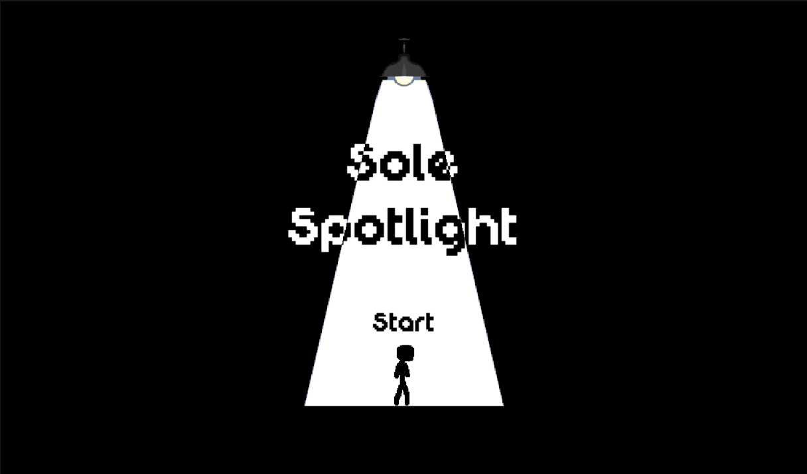
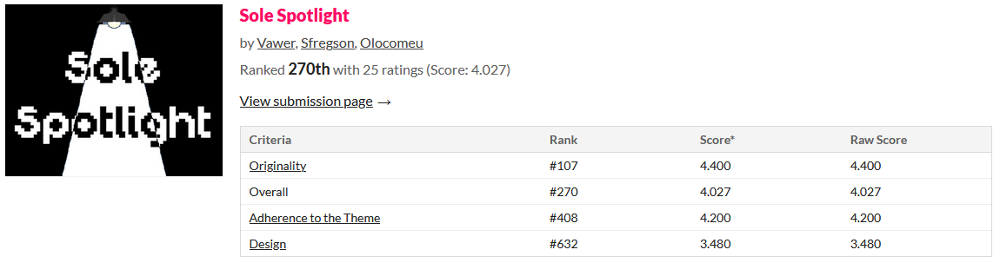

# Sole Spotlight

A game made for the 2019 edition of the annual game jam [GMTK](https://gmtk.itch.io/). The theme for the [GMTK2019](https://itch.io/jam/gmtk-2019) jam was *"Only one"*.

## Demo

The room is completely dark and there is Only One Spotlight to illuminate it. Use your cursor to swing the spotlight by clicking and holding on the light beam. There is an exit in each room and its your job to guide the frightened little guy to it. But beware! If he is out of the light for too long he will become too scared to move and you'll have to try again. There are also some obstacles along the way, so be sure to keep him safe!

You can play the game by accessing this link: [Sole Spotlight](https://vawer.itch.io/sole-spotlight).

## Jam Results

For the final rankings, Sole Spotlight placed at 270th out of 2604 entries, with an overall score of 4.027 out of 5. More detailed results can be seen in the following image:

## Accessing Source Code

To play around with the game assets and code, you will need Unity version 2019.1.11f1 or later.