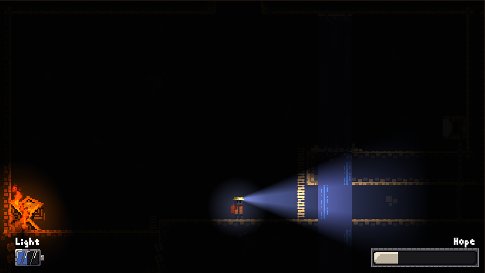
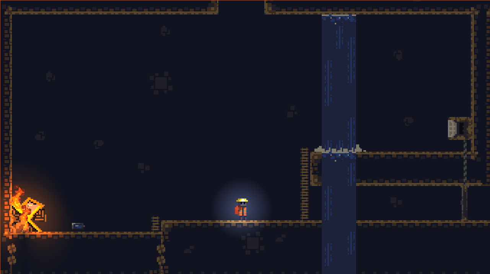
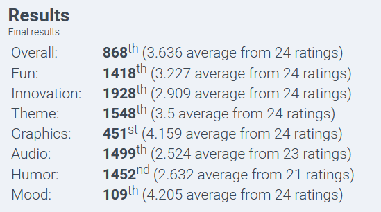

# Keep Hope Alive

A game made for the 46th edition of the [Ludum Dare](https://ldjam.com/) game jam. The theme for [LDJ46](https://ldjam.com/events/ludum-dare/46/) was *"Keep it Alive"*.

## Demo

Lost in an unknown cave, your goal is to figure out how to escape it while making sure you don't lose all hope. Certain objects or events might rekindle hopefull memories or trigger desperate emotions, so be careful while exploring. Along the way, you'll find tools such as a flashlight and a pickaxe to aid you in your path. Try to move forward while keeping hope alive.

 

### Lighter Room

Same room under brighter lighting to showcase the artwork.

You can play the game by accessing this link: [Keep Hope Alive](https://vawer.itch.io/keep-hope-alive).

## Jam Results

 

## Accessing Source Code

To play around with the game assets and code, you will need Unity version 2019.3.10f1 or later.
